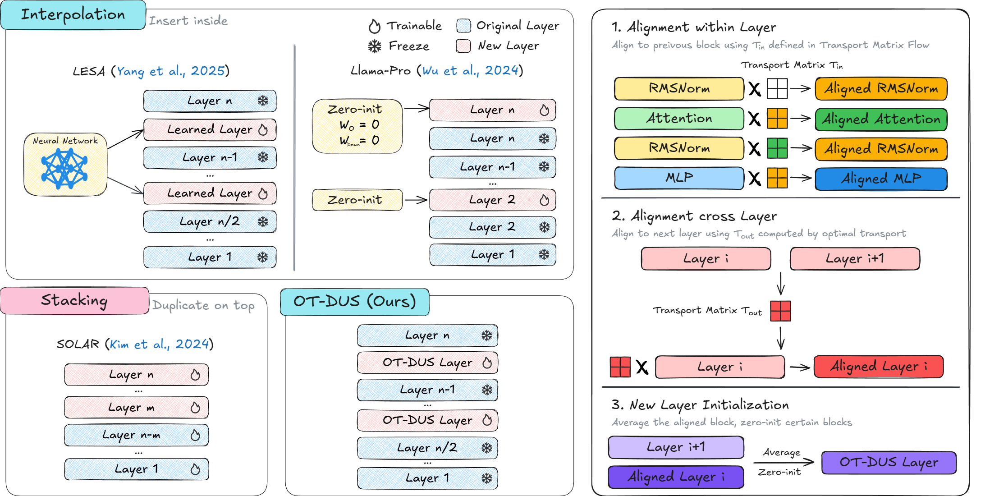

# OpT-DeUS
This is the source code for "Progressive Depth Up-scaling via Optimal Transport"


# Core packages and version
```text
transformers             4.48.2
datasets                 3.6.0
lm_eval                  0.4.2
accelerate               1.3.0
flash-attn               2.5.9
numpy                    1.26.4
POT                      0.9.5
pytorch (decided by the HPC's cuda driver)
```

# Description
- `Data.py` provides the sampling and preprocessing process for our Continual Pre-training data.
- `Eval.sh` provides the shell script for evaluating the trained models.
- `Model` directory contains the implementation of depth up-scaling baselines and our proposed Methods.


# Note
- For SFT, we use  `Alpaca-GPT4` from https://huggingface.co/datasets/vicgalle/alpaca-gpt4. Thus no script is provided.
- For creating the expanded model using `LESA`, we directly use the implementation from https://github.com/yangyifei729/LESA.

