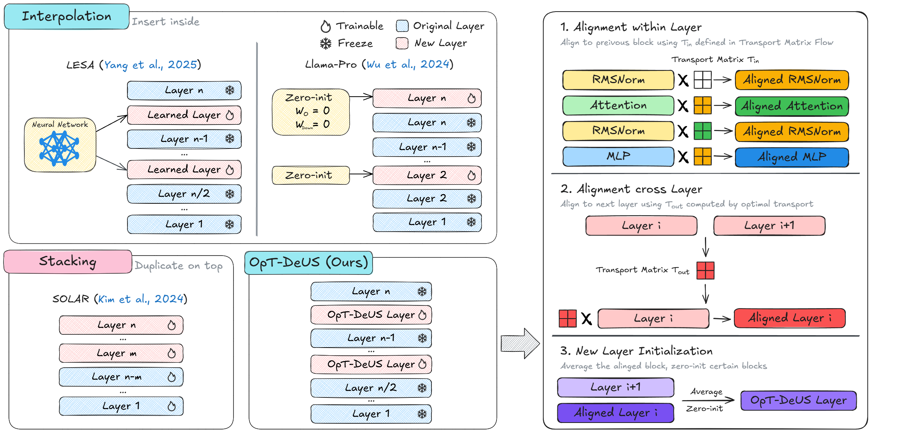

# OpT-DeUS
This is the source code for "Progressive Depth Up-scaling via Optimal Transport"


# Core packages and version
```text
transformers             4.48.2  (For training with GPU)
datasets                 3.6.0   (For preprocessing data)
lm_eval                  0.4.2   (For evaluation)
accelerate               1.3.0   (For multi-Gpu parallesim)
flash-attn               2.5.9   (For accelerated training)
POT                      0.9.5   (For solving Optimal Transport)
pytorch                  2.3.1   (For training with GPU)   
trl                      0.16.1  (For SFT)
```

# Description
- `Data.py` provides the sampling and preprocessing process for our Continual Pre-training data.
- `Eval.sh` provides the shell script for evaluating the trained models.
- `Model` directory contains the implementation of depth up-scaling baselines and our proposed Methods.


# Note
- For SFT, we use  `Alpaca-GPT4` from https://huggingface.co/datasets/vicgalle/alpaca-gpt4. Thus no script is provided.
- For expanding the model using `LESA`, we use the implementation from https://github.com/yangyifei729/LESA.
- `Model` contains code used for expanding LLaMA 3.1-8B. They can be can be easily adapted for other scales by changing the `index_mapping` and `num_hidden_layers`.
